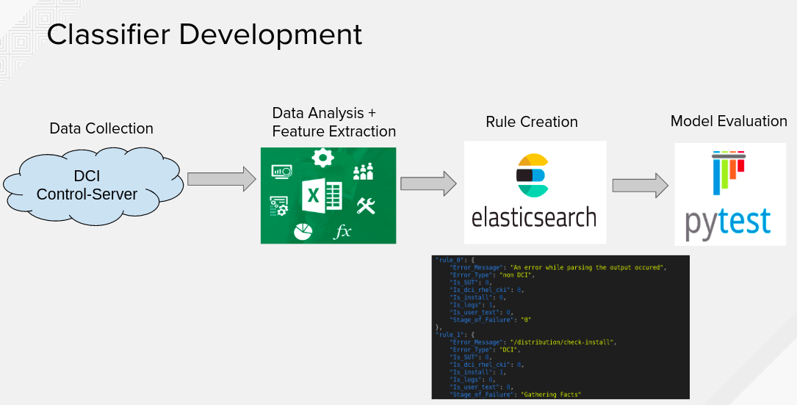

# Distributed CI Error Classifier

 

# Objective

In the current setup when a job fails we don’t know if it failed because of DCI issue or issue is at partners end. As test cases are executed at partners end, error can be specifically caused because of issues in partners systems or networks. All these jobs have to be first checked by an RH developer and based on the error it is decided if it is an RH issue or partner issue.

To save time, we build an error log classification model using machine learning and NLP techniques . This model reads the job data and automatically classifies the failed log into DCI or non DCI. Once the job is classified, RH resources have to invest time only for jobs which are marked as DCI error type and all other jobs are redirected to corresponding partners.

## Classifier

The classifier is built using a rule based system in NLP. Rules are stored in the elasticsearch database. Below is the pipeline for the model development. 

{:height="50%" width="50%"}

